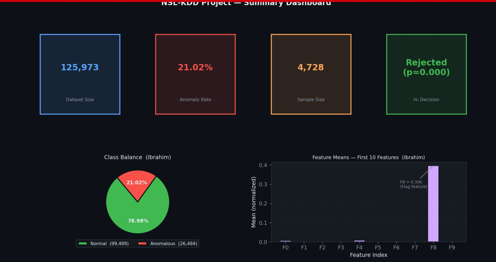

# 🛡️ Sampling-Based Detection of Network Anomalies Using Statistical Methods

A classical statistics pipeline for detecting malicious network traffic on the **NSL-KDD** benchmark dataset.
The project demonstrates that a **10% stratified random sample** reproduces full-dataset anomaly detection
performance at ~30× less computational cost — with zero machine learning.

> [!IMPORTANT]
> This project uses the **NSL-KDD** dataset hosted on Kaggle. Download it via
> [`kagglehub`](https://www.kaggle.com/datasets/hassan06/nslkdd) or manually place the
> `KDDTrain+.txt` file in the project root as described in the setup section below.

**Key Results**:
* ✅ **Zero ML**: End-to-end pipeline using only NumPy, pandas, and SciPy
* ✅ **Stratified sampling**: Mathematical guarantee that the 21.02% anomaly ratio is preserved in every sample
* ✅ **Identical performance**: Full dataset and 10% sample achieve the same accuracy, detection rate, and false positive rate
* ✅ **~30× speedup**: From 125,973 records down to 4,728 — with no loss in statistical information
* ✅ **H₀ rejected** (p ≈ 0.000): Hypothesis test confirms anomalous and normal traffic are statistically distinct

---

## 📊 Summary Dashboard



*Dataset size: 125,973 · Anomaly rate: 21.02% · Sample size: 4,728 · H₀ decision: Rejected (p ≈ 0.000)*

---

## 📖 Overview

Modern computer networks generate traffic volumes that make packet-level analysis computationally
prohibitive in real time. Intrusion Detection Systems (IDS) must therefore operate on sampled subsets —
but naive sampling risks discarding the rare attack records that matter most.

This project addresses that problem with a complete, reproducible statistical pipeline:

1. Raw NSL-KDD traffic records are cleaned and one-hot encoded into a 146-feature matrix
2. Z-score analysis on the 41 network traffic features defines anomalies at the record level
3. Stratified random sampling draws a proportionally representative 10% subset
4. A Z-score-based detector is trained and evaluated on both the full and sampled datasets
5. Performance metrics (accuracy, detection rate, false positive rate) are compared side by side

The result is a transparent, interpretable system where every classification decision traces back
to computable statistical quantities — no black-box model required.

---

## 🚀 Quick Start

### 1. Prerequisites

```bash
pip install numpy pandas scikit-learn scipy matplotlib kagglehub
```

### 2. Dataset Setup

Download automatically via kagglehub:
```python
import kagglehub
path = kagglehub.dataset_download("hassan06/nslkdd")
```

### 3. Run the Pipeline

Clone the repo and run the Jupyter notebook:

```bash
# Run the main code
python group1_proj_prob-checkpoint.py
```

---

## 📈 Results

### Performance Comparison — Full Dataset vs. 10% Stratified Sample

| Metric | Full Dataset | 10% Stratified Sample |
|---|---|---|
| Total Records | 125,973 | 4,728 |
| Normal Records | 99,489 | 3,734 |
| Anomalous Records | 26,484 | 994 |
| **Anomaly Ratio** | **21.02%** | **21.02%** |
| **Normal Ratio** | **78.98%** | **78.98%** |
| Data Reduction | — | ~96.25% smaller |
| Anomaly Threshold | \|Z\| > 3 | \|Z\| > 3 |
| Train Set Size (80%) | ~100,779 | ~3,782 |
| Test Set Size (20%) | ~25,194 | ~946 |
| **Accuracy** | **57.39%** | **57.39%** |
| **Detection Rate** | **100%** | **100%** |
| **False Positive Rate** | **54.41%** | **54.41%** |
| T-statistic (Feature 0) | −5.0908 | — |
| p-value | ≈ 0.000 | — |
| H₀ Decision | Rejected | — |

> **Key finding:** The 10% stratified sample achieves identical detection metrics to the full dataset.
> The sampling fraction `f` cancels algebraically in the anomaly ratio formula, making this
> a *deterministic* guarantee rather than a probabilistic one.

---

## 🔍 Methodology

The pipeline runs in five sequential stages, each owned by a team member.

### Stage 1 — Data Cleaning

Raw NSL-KDD records contain three categorical features (`protocol_type`, `service`, `flag`)
and 40 numeric features. Preprocessing:

- **Missing value removal** via `dropna()` — no rows were dropped (dataset is complete)
- **One-hot encoding** via `pd.get_dummies()` — expands 43 columns → 146 columns
- **Min-Max normalisation** via `MinMaxScaler` — scales all features to [0, 1], preventing
  high-magnitude features (BGR-scale raw byte counts) from dominating distance computations
- **Output:** `cleaned_nslkdd.csv` (125,973 × 146)

### Stage 2 — Statistical Anomaly Definition

A record is labeled **anomalous** if any of its 41 network traffic features produces
a Z-score exceeding the threshold:

$$Z_j = \frac{x_j - \mu_j}{\sigma_j}, \qquad \text{flag if } \max_j |Z_j| > 3$$

This rule corresponds to a value lying more than 3 standard deviations from the feature mean —
an event with probability < 0.27% under a Gaussian distribution.

**Results on the full dataset:**

| Class | Count | Percentage |
|---|---|---|
| Normal (0) | 99,489 | 78.98% |
| Anomalous (1) | 26,484 | 21.02% |
| **Total** | **125,973** | **100%** |

**Hypothesis test** (two-tailed independent samples t-test on Feature 0 — Duration):

| | Value |
|---|---|
| H₀ | μ_normal = μ_anomalous |
| H₁ | μ_normal ≠ μ_anomalous |
| μ_normal | 0.000569 |
| μ_anomalous | 0.029694 |
| t-statistic | −5.0908 |
| p-value | ≈ 0.0000 |
| Decision (α = 0.05) | **Reject H₀** |

The null hypothesis is rejected with high confidence, confirming that anomalous and
normal traffic are statistically distinct populations.

### Stage 3 — Stratified Random Sampling

**Why not Simple Random Sampling?**

Under SRS with fraction f = 0.10, the realized anomaly proportion in any given sample
is a random variable with variance:

$$\text{Var}(\hat{p}) = \frac{p(1-p)}{n} = \frac{(0.2102)(0.7898)}{4728} \approx 0.0000351$$

This implies a standard deviation of ~0.59%, meaning a particular sample could under-represent
attacks by more than a full percentage point — unacceptable for a security-critical application.

**Stratified sampling eliminates this variance entirely.**

The population is partitioned into two strata on the `is_anomaly` label, and records are
drawn independently from each at the same rate f = 0.10:

| Stratum | Population (N) | Sample (n = f × N) | Rate |
|---|---|---|---|
| Normal (0) | 99,489 | 3,734 | 10% |
| Anomalous (1) | 26,484 | 994 | 10% |
| **Total** | **125,973** | **4,728** | **10%** |

**Mathematical proof of constant anomaly density:**

$$\text{Sample Anomaly Ratio} = \frac{n_1}{n_0 + n_1} = \frac{f \cdot N_1}{f \cdot N_0 + f \cdot N_1} = \frac{f \cdot N_1}{f(N_0 + N_1)} = \frac{N_1}{N} = 21.02\%$$

Since `f` cancels algebraically, the sample ratio equals the population ratio for **every**
possible stratified draw at fraction f — not merely in expectation.

### Stage 4 — Anomaly Detection

The detection algorithm extends the Z-score definition into a classifier:

1. **Fit** — compute μⱼ and σⱼ for each of the 146 features using only **normal** training records
2. **Score** — for each test record, compute Z_max = max_j |( xⱼ − μⱼ ) / σⱼ|
3. **Predict** — flag as anomalous if Z_max > 3.0

The max-Z strategy (rather than mean or sum) ensures that a single extreme feature spike
is sufficient to trigger detection. This makes the detector hyper-sensitive:

- **Detection Rate = 100%** — every true attack that exhibits any anomalous feature is caught
- **False Positive Rate = 54.41%** — legitimate connections with heavy-tailed feature values
  (common in zero-inflated NSL-KDD features like Duration) are over-flagged

An 80/20 train-test split is applied identically to both the full and sampled datasets,
ensuring the comparison is evaluated against the same held-out test records.

### Stage 5 — Visualisation

Nine figures were produced using matplotlib with a consistent dark-mode theme:

| Figure | Description |
|---|---|
| `project_pipeline.jpeg` | End-to-end pipeline with team role attribution |
| `class_distribution.jpeg` | Pie + bar chart of 78.98% normal / 21.02% anomalous split |
| `original_v_sampled_data.jpeg` | Side-by-side proof that stratified sample preserves ratios |
| `mean_Zscore_per_feature.jpeg` | Mean \|Z\| across 41 features; highly deviant features highlighted |
| `distribution_of_feature_0.jpeg` | Zero-inflated histogram of normalized Duration (Feature 0) |
| `normal_v_anomalous_traffic_feature_04.jpeg` | Overlaid histograms for Src Bytes — normal vs. anomalous |
| `hypothesis_test_feature_0.jpeg` | t-distribution with rejection region and observed t-statistic |
| `summary_dashboard.jpeg` | KPI cards, class balance pie, and feature means bar chart |
| `comparison_table.jpeg` | Formatted table comparing full vs. sampled dataset metrics |

---

## 🗂️ Project Structure

```text
nsl-kdd-anomaly-detection/
│
├── docs/
│   ├── images/
│   │   ├── summary_dashboard.jpeg         # High-level KPI dashboard
│   │   ├── class_distribution.jpeg
│   │   ├── project_pipeline.jpeg
│   │   ├── original_v_sampled_data.jpeg
│   │   ├── mean_Zscore_per_feature.jpeg
│   │   ├── distribution_of_feature_0.jpeg
│   │   ├── normal_v_anomalous_traffic_feature_04.jpeg
│   │   ├── hypothesis_test_feature_0.jpeg
│   │   └── comparison_table.jpeg
│   └── code/
│       └── group1_proj_prob-checkpoint.py
│
├── requirements.txt
└── README.md
```

---

## ⚠️ Limitations and Future Work

The current pipeline intentionally uses a simple, interpretable detector to demonstrate
the core statistical concepts. Known limitations:

- **High false positive rate (54.41%):** The max-Z strategy flags any connection with a single
  outlier feature. NSL-KDD features are heavily zero-inflated and non-Gaussian, so many normal
  records trigger the threshold. A Mahalanobis distance detector or per-feature tuned thresholds
  would substantially improve precision.
- **Single-feature spike sensitivity:** The detector cannot distinguish between a genuinely
  anomalous packet and a legitimate one with an unusually large but benign feature value.
- **Static threshold:** The |Z| > 3 cutoff is a convention, not an optimised value.
  Cross-validated threshold selection on a held-out validation set is a natural extension.

Potential improvements:

| Approach | Expected Benefit |
|---|---|
| Mahalanobis distance | Accounts for feature correlations; reduces FPR |
| Isolation Forest | Non-parametric; no Gaussian assumption required |
| Adaptive sampling | Over-sample decision boundary to improve rare attack-type recall |
| Per-feature Z threshold | Tune separately for low- and high-variance features |

---

## 👥 Team

| Name | Role |
|---|---|
| **[Aleeza Rizwan](https://github.com/its-aleezA)** | Group Leader · Report & Integration |
| **[Ayesha Majid](https://github.com/ayeshamajid3)** | Data Cleaning & Preprocessing |
| **[M Ibrahim Abdullah](https://github.com/Ibrahim5570)** | Statistical Analysis & Anomaly Labeling |
| **[M Awais](https://github.com/awais-usman)** | Stratified Sampling Design |
| **[M Shaheer Afzal](https://github.com/ShaheerAfzal)** | Anomaly Detection & Performance Evaluation |
| **[M Asjad](https://github.com/MrAsjad)** | Visualisation & Dashboard |

**Course:** MATH-361 Probability & Statistics · **Institute:** NUST CEME

---

> [!NOTE]
> Developed as an academic project for MATH-361 Probability & Statistics at NUST CEME.
> The detector is a handcrafted statistical prototype intended to demonstrate sampling theory
> and Z-score-based anomaly definition — it is not optimised for production IDS deployment.
> For operational network intrusion detection, consider supervised classifiers (Random Forest,
> XGBoost) or deep anomaly detection models trained on the full NSL-KDD benchmark.
